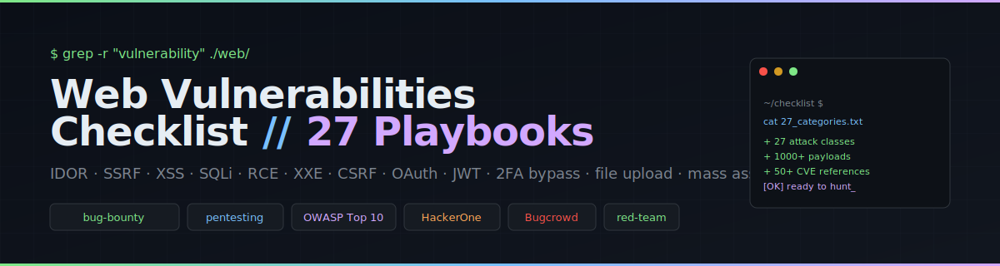

<p align="center">
  
</p>

<h1 align="center">Web Vulnerabilities Checklist</h1>

<p align="center">
  Twenty-seven attack-class playbooks for web application bug bounty hunting and penetration testing.
</p>

<p align="center">
  <a href="https://github.com/AnukarOP/Web-vulnerabilities/stargazers"></a>
  <a href="https://github.com/AnukarOP/Web-vulnerabilities/network/members"></a>
  <a href="https://github.com/AnukarOP/Web-vulnerabilities/issues"></a>
  <a href="https://github.com/AnukarOP/Web-vulnerabilities/commits/main"></a>
  
</p>

---

## About

A reference of practical web application vulnerabilities organized by attack class. Each folder contains payloads, bypass tables, exploitation flows and CVE references that you can copy directly into Burp, Caido, ZAP or your terminal. Maintained by [@AnukarOP](https://github.com/AnukarOP).

Use it on programs hosted by HackerOne, Bugcrowd, Intigriti, YesWeHack or Synack, in penetration tests, in CTFs, or as study material for OSCP / OSWE / eWPTX / PortSwigger Web Security Academy.

## Index

| # | Category | Scope |
|---|----------|-------|
| 01 | [AEM Misconfiguration](Aem%20misconfiguration/aem.md) | Dispatcher bypass, servlet abuse, SSRF, Groovy console RCE |
| 02 | [Authentication](Authentication/authentication.md) | Auth bypass, captcha bypass, weak password policy, user enumeration |
| 03 | [IDOR](IDOR%20Vulnerability/idor.md) | Object-level access, parameter pollution, hashed-ID prediction |
| 04 | [Business Logic](Bussiness%20Logic/bussiness%20logic.md) | Price tampering, coupon abuse, refund fraud, parameter tricks |
| 05 | [Jira Vulnerabilities](Jire%20Vulnerability/jire.md) | Atlassian Jira / Confluence CVEs and misconfigurations |
| 06 | [Registration](register%20vulnerability/register.md) | Signup XSS, verification bypass, disposable email, username squatting |
| 07 | [2FA Bypass](2FA%20Bypass/2FA%20bypass.md) | OTP brute force, response manipulation, session elevation |
| 08 | [Admin Panel](Admin%20panal/adminpanal.md) | Default credentials, SQLi auth bypass, parser confusion |
| 09 | [EXIF Geolocation](exif%20Vulnerability/exif_geo.md) | Image metadata exposure, GPS leakage |
| 10 | [Cookie Attacks](Cookie%20Attack/cookie.md) | Session fixation, cookie injection, parameter pollution, cookie bomb |
| 11 | [Password Reset](reset%20password/reset_password_checklist.md) | Host header injection, token reuse, race conditions |
| 12 | [Account Takeover](Acount%20takeover/ATO.md) | OAuth ATO, pre-ATO, XSS → ATO, CSRF → ATO chains |
| 13 | [403 Bypass](403%20Bypass/403-bypass.md) | Header injection, URL encoding, path normalization |
| 14 | [Tips from Twitter — Part 1](tips%20from%20twitter/tips_twitter.md) | Recon one-liners, JWT cheats, CDN-origin bypass |
| 15 | [Tips from Twitter — Part 2](tips%20from%20twitter%202/tips_twitter_P2.md) | WAF XSS bypass, file-upload variants, sitemap SQLi |
| 16 | [SQL Injection](Sql%20injection/sqlpayload.md) | Error-based, time-based, UNION, blind, NoSQL, stacked queries |
| 17 | [Reflected XSS](RXSS/xss.md) | XSStrike, dalfox, gxss, polyglots, WAF bypass |
| 18 | [File Upload](File%20Upload/File%20Upload.md) | Extension bypass, magic-byte tricks, ImageTragick, ZIP slip, SVG XXE |
| 19 | [Rate Limit Bypass](Rate%20limit/bypass%20rate%20limit.md) | Null-byte, header rotation, IP spoofing |
| 20 | [JSON Attacks](Json%20Attack/json.md) | 95-test fuzzing menu — type juggling, NoSQL operators, HPP |
| 21 | [CSRF](CSRF/csrf.md) | Token bypass, method override, mirrored-cookie tokens |
| 22 | [RCE](RCE/RCE.md) | Dependency confusion, LFI, SSRF, XXE, deserialization, SSTI |
| 23 | [API Authorization](Api%20Authorization/Authorization.md) | BOLA patterns, predictable IDs, CRLF in IDs, array smuggling |
| 24 | [API Authentication](Api%20Authentication/Authentication.md) | 95 JSON-auth payloads for `/login`, `/register`, `/oauth/token`, GraphQL |
| 25 | [Mass Assignment](Mass%20Assignment/Mass.md) | `is_admin`, `role`, `user_priv` injection, organization escalation |
| 26 | [Django](Hacking%20Django/Django.md) | Django RCE, debug-panel exposure, fuzzing wordlist |
| 27 | [Symfony](Hacking%20Symfony/Symfony.md) | Secret-fragment RCE, sensitive-path discovery |

## Suggested toolchain

```
recon        subfinder, assetfinder, dnsx, httpx, chaos, amass
crawling     katana, gau, waybackurls, hakrawler, gospider
params       arjun, paramspider, paraminer-ng
scanners     nuclei, dalfox, sqlmap, xsstrike
proxies      Burp Suite, Caido, OWASP ZAP, mitmproxy
js recon     LinkFinder, SecretFinder, jsleak
fuzzing      ffuf, feroxbuster, dirsearch, wfuzz
jwt / auth   jwt_tool, hashcat, john
cloud        pacu, scoutsuite, prowler
```

## Contributing

Pull requests are welcome. New payloads, new CVEs, new bypass techniques and new exploitation chains all belong here. Keep additions:

- written in clear English
- backed by a payload, command or PoC
- free of any private or unauthorized target data

## License

MIT — see [LICENSE](LICENSE).

## Disclaimer

This repository is intended for authorized security testing and education. Use it on systems where you have explicit written permission (your own systems, lab environments such as PortSwigger Web Security Academy, HTB, TryHackMe, or programs that publicly invite testing). Unauthorized access to computer systems is illegal in most jurisdictions. The maintainer is not responsible for misuse.

---

<sub>Maintained by <a href="https://github.com/AnukarOP">@AnukarOP</a>. If this saved you time, a star helps other hunters find it.</sub>
